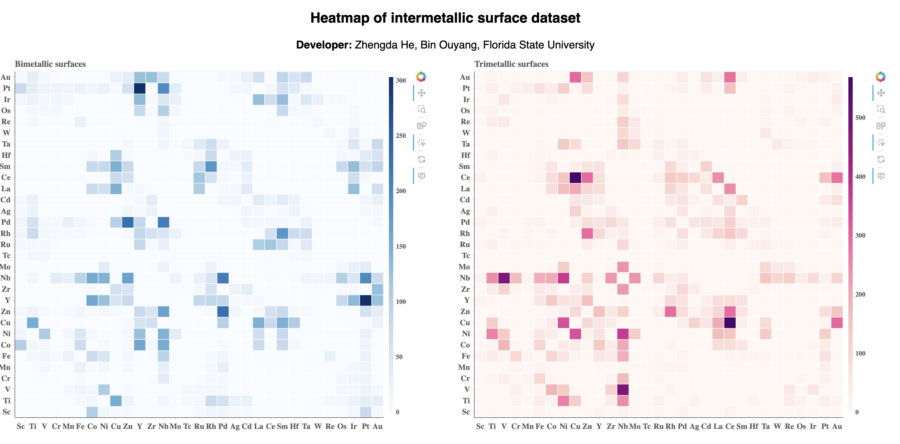
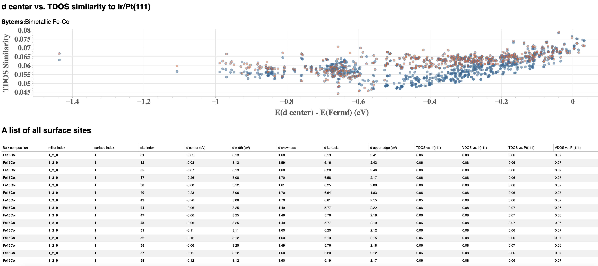

# Database of Electronic Structures for Intermetallic Surfaces

In our work of [Charting the Electronic Structure for Discovering Intermetallic Catalysts](Available after publication), we computed electronic structure of 12,057 
intermetallic surface generated from a pool of 2,358 binary and tenary intermetallic hosted in [Materials Project](https://next-gen.materialsproject.org/)

## Interactive database
The database is available interactively at [this link](https://jeff-oakley.github.io/Intermetallic_surface/htmls/IntermallicHeatmap.html). For any inquiry of 
the raw data, feel free to email Prof. Bin Ouyang at [bouyang@fsu.edu](mailto:bouyang@fsu.edu)

## Usage of the Interactive database
* `Heatmap of intermetallic heatmap` \
The index page of the [Database Website](https://jeff-oakley.github.io/Intermetallic_surface/htmls/IntermallicHeatmap.html) \

* `Chart of electronic structures` \
By clicking any elemental pair that you are interested in. It will direct you into the corresponding data page of specific
metal pair. The example of all data for Co-Fe bimetallic systems are shown below


## Citing
We offer such dataset for promoting the transparency of research. Whenever our repo can be useful for you,
please consider citing our paper
```
@article{IntermetallicSurface,
  title={Charting the Electronic Structure for Discovering Intermetallic Catalysts},
  author={He, Zhengda and Ouyang, Bin},
  journal={Under review},
  html={Under review},
  year={2024}
}
```
